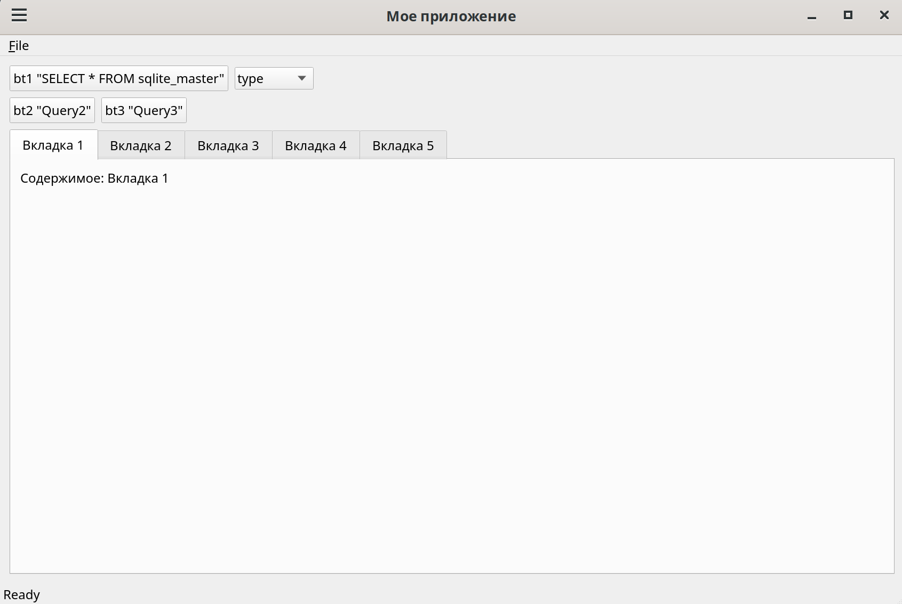
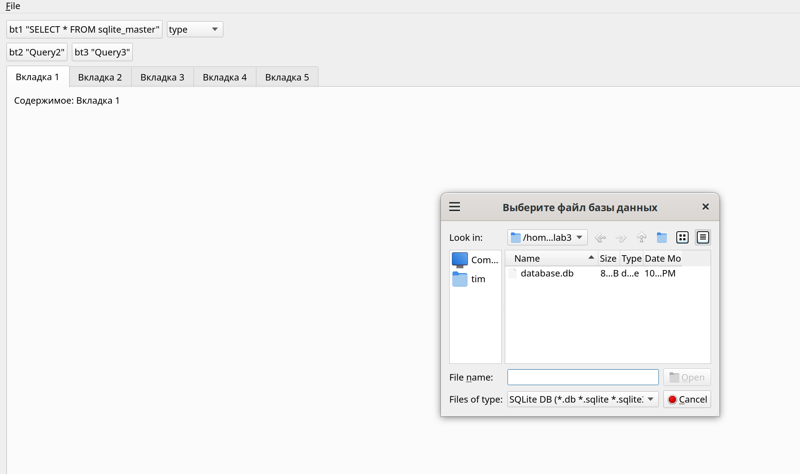
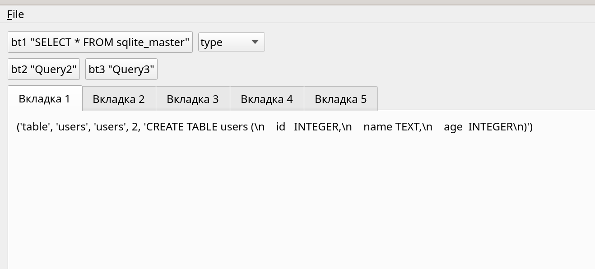
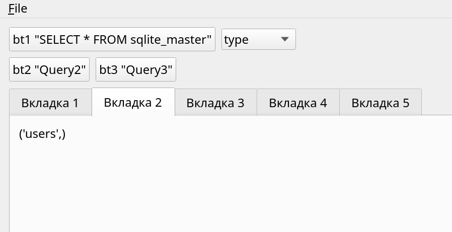
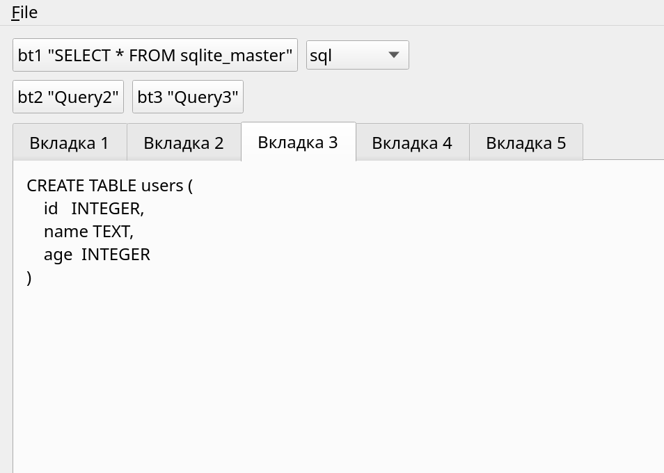
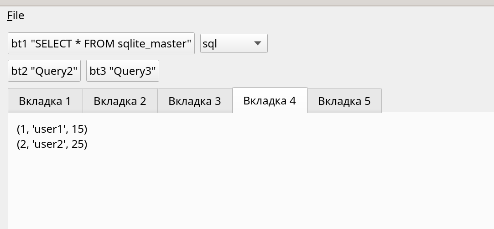
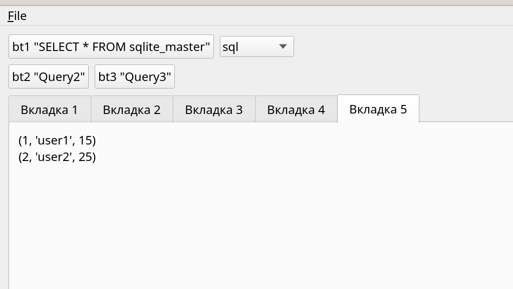
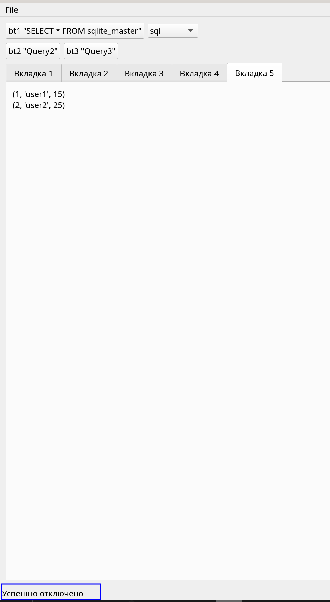

Задание: Реализовать приложение на PyQt с использованием представления таблиц и работы с SQL.
В меню две вкладки: Set connection (установить соединение с БД) (QFileDialog для поиска и выбора БД), Close connection (очистить все, закрыть соединение с бд).
По умолчанию можно сделать в QTabWidget вкладки пустыми, либо создавать их по выполнению запросов при нажатии на функциональные клавиши.
Сразу после успешного коннета в Tab1 устанавливается таблица, соответствующая запросу «SELECT * FROM sqlite_master».
Кнопка bt1 делает выборочный запрос, например, «SELECT name FROM sqlite_master», результат выводится в Tab2.
При выборе колонки из выпадающего списка QComboBox результат соотвествующего запроса отправляется в Tab3.
Кнопки bt2 и bt3 выполняют запрос по выводу таблицы в Tab4 и Tab5

Скриншоты программы:
Вид программы при запуске. В меню File есть два пункта: подключится к базе данных, отключится от базы данных   
  
При нажатии кнопки "подключится к базе данных" выполняется подключение к БД и выводится результат запроса "select * from sqlite_master" в вкладке 1.    
  
  
При нажатии кнопки "bt1" выполняется результат запроса "select name from sqlite_master" в вкладке 2.  
  
При выборе переменной (type,name,tbl_name,rootpage,sql) в QComboBox выполняется результат запроса "select name {var} sqlite_master в вкладке 3.  
  
При нажатии кнопки "bt2" выполняется результат запроса "select name from users" в вкладке 4.  
  
При нажатии кнопки "bt3" выполняется результат запроса "select name from users" в вкладке 5.  
  
При нажатии кнопки "отключится от базы данных" в меню File происходит отключение от БД. В строке статуса выводится результат выполнения данной операции  
  
